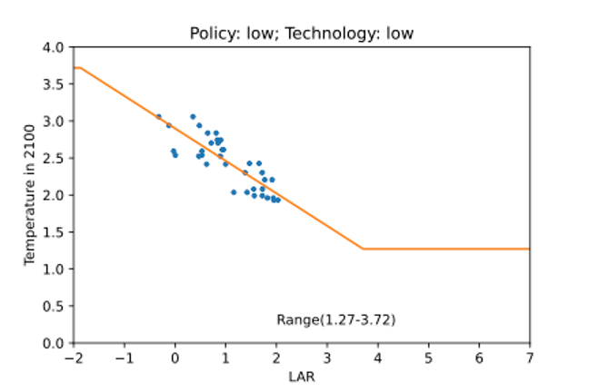

Til Dietrich, Sorin Dragan, Paul Rösler

Table of Content

**[Introduction](#introduction)**  
**[Temperature Score Estimation](#temperature-score-estimation)**  
> [Prediction & Extrapolation](#prediction--extrapolation)  
> [Scenario Choice](#scenario-choice)  
> [Step 1: Building the scenario sets](#step-1-building-the-scenario-sets)  
> [Step 2: Estimating regressions](#step-2-estimating-regressions)  
> [Company temperature scores](#company-temperature-scores)  
**[Final Comments](#final-comments)**

# Introduction

This document lays out the methodological framework for the development
of the new *Oxari Temperature Score*[^1] (OTS). It partially builds on
Carbon Disclosure Project (CDP) and World Wide Fund for Nature’s (WWF)
open source Temperature Rating Methodology (TRM)[^2], in which the
underlying idea is to deduct a unique temperature score from the varying
company greenhouse gas (GHG) emission targets to have one single
indicator that is easily comparable and entails the aggregated
information of climate scenario research.

The OTS builds on this framework adjusting it in two ways:

1.  **Temperature Score based on Technology & Policy scenarios**

> In the TRM, the temperature score is assigned through a linear
> regression which is based on a set of climate scenario pathways[^3].
> It essentially applies different filters to the entire scenario
> database, builds subsets and then takes the subset that produces the
> best-fitting linear regression. While this yields one single score per
> company, it is rather rigid. The OTS allows for some degree of
> flexibility. It introduces two variables that allow the user to
> distinguish different climate scenarios. One is policy risk, based on
> the scenario’s assumed carbon price, and the other one is
> technology-dependency, focusing on the mitigation scenario set’s
> reliance on carbon dioxide removal (CDR).

2.  **Increase Coverage**

> The TRM is only suited to assign temperature scores to companies which
> actually publish carbon emission targets. Companies that fail to do so
> get a default score. AI predictions from the *Oxari Corporate Carbon
> Estimator* fill gaps in historic and current company CO2 emissions
> data. These reported or predicted historic emission values in turn are
> used to generate a company’s temperature score. While the SBTi
> database has 4,237 companies with reported targets in the data, 2,081
> of them approved, the OTS provides temperature scores on over 30,000
> companies worldwide.[^4]

The final outcome is a tool, in which users can browse through a
database of companies and obtain estimates on its temperature score
depending on different assumptions concerning policy pathways and
technology-dependency. Both variables have three (3) levels resulting in
nine (9) possible policy-technology scenario combinations.

In the following, we provide a detailed description of the underlying
methodology.

# Temperature Score Estimation

The estimation of the Oxari temperature scores consists of two main
parts. Firstly, the prediction & extrapolation of CO2 emissions and
secondly, the choice of scenarios. The former concerns individual
companies, while the latter is about building a meaningful average
pathway from the large number of climate scenarios that the IAMC 1.5°C
Scenario Explorer[^5] provides, given the aforementioned policy and
technology-dependency assumptions. The corporate emissions and climate
scenarios are matched through a common variable, the linear annual
reduction (LAR, in %) in CO2 emissions.

## Prediction & Extrapolation

Many companies do not report their CO2 emissions and only few set
reduction targets. This makes it intrinsically difficult to get an
understanding of their performance in terms of climate change and future
environmental developments. To overcome the lack of
data, the OTS uses Oxari’s Corporate Carbon Estimator, which predicts
Scope 1-3 emissions of non-reporting companies by using public company-,
industry-, and country-level data and machine learning models trained on
large corporate emission datasets. In this methodology, the year
2016 serves as the starting point for the time series, as the Paris
Agreement[^6] came into effect shifting the focus to carbon reduction
drastically and globally. As a result, there has been an increasing
number of companies reporting on carbon emissions[^7]. Based on the
historical and current reported and predicted values, the LAR is
calculated and matched with the average annual reduction derived from
the scenarios as described in the next section.

## Scenario Choice

Research on future pathways of the world’s climate is manifold. Release
2.0 from the Integrated Assessment Modeling Consortium (IAMC) contains
417 different scenarios, with each scenario containing a different set
of underlying assumptions concerning not only climate-related but also
socio-economic factors[^8]. Based on these underlying assumptions,
conclusions concerning global warming can differ substantially. While
this myriad of information is certainly valuable for climate
researchers, it is essential for our task to find a meaningful average
scenario, given the policy and technology filters, that incorporate as
much information as possible while removing outliers. The TRM finds a
meaningful and realistic average scenario by applying various filters
and picking the set that has the largest R2 when regressing LAR on the
global temperature in 2100 (see Table 2). One of these variables is the
type of emissions. While this can make sense when finding a scenario set
on purely statistical grounds, we follow a different approach. In our
opinion, it makes sense for this application to choose the variable
beforehand based on qualitative arguments. Because we would like to have
a temperature score that is representative for a wide variety of
companies in various industries, we opt to work with *Kyoto Gases*[^9]
as the emissions variable. The goal is to find a scenario set that
realistically forecasts the relationship between LAR and the global
temperature by 2100. Because there is a high degree of variability among
the different climate scenarios, depending largely on the underlying
assumptions, we would like to refrain from estimating only one number.
Instead, we follow an approach, where the users can choose a path that
suits their expectations.

| **Table 2**           |              |                                                     |                   |                                       |             |
|-----------------------|--------------|-----------------------------------------------------|-------------------|---------------------------------------|-------------|
| **Variable / Filter** | **peak_yrv** | **peak_varv**                                       | **applied**       | **cdr_lim**                           | **cdr_var** |
| 1                     | 2020         | Emissions \| Kyoto Gases                            | 1.5C              | cdr\|max                              | -10         |
| 2                     | 2025         | Emissions \| CO2 \| Energy and Industrial Processes | 1.5C and 2C       | minimum.net.CO2.emissions.(Gt.CO2/yr) | -1000       |
| 3                     | 2030         |                                                     | 1.5C and lower 2C |                                       | -15         |
| 4                     | 2100         |                                                     |                   |                                       | -20         |

### Step 1: Building the scenario sets

To do so, we split the scenarios into three policy categories,
represented by the upper, middle and lower tercile of carbon prices.
These groups are considered strong, average and weak political action,
respectively. We then follow a similar approach for the
technology-dependency categories, using a cumulative CDR variable, which
allows us to not only measure the degree of technological development
but also the timing. This leads to more variability in the forecasted
temperature score. Each company receives nine (9) theoretical scores
based on the chosen policy and technology dependency category. This
procedure, in combination with how we choose the emissions variable,
highlights our approach of combining thorough statistical analysis while
also making decisions based on qualitative arguments where it makes
sense.

### Step 2: Estimating regressions

We start by calculating the LAR for each scenario. Subsequently, we use
bounded linear regressions (see below) to correlate the resulting LAR
with the global temperature in 2100 (66% probability) within each
scenario set. Based on the adjusted-R2 as a goodness-of-fit measure we
choose nine (9) scenarios sets, one for each combination of our two
socio-economic variables: (i) policy and (ii) technology. The reason for
choosing the scenario sets as such is to have a selection of
model-scenario combinations that represents the respective level of
policy stringency and technological development. This should also be
reflected in the set of possible temperature scores within a scenario
set. For example, the range of temperature scores in a low policy
intervention and low technological development scenario set, should be
systematically lower than for the opposite case of high policy
intervention and high technological development.

We introduce minimum and maximum temperature score boundaries that a
company can reach within any given scenario set. The reason for this is
that simple unbounded linear regressions, in some cases, result in
unrealistically large and scientifically ungrounded temperatures for
some companies.

Figures 1 and 2 show that this is ensured by setting minimum and maximum
boundaries.

**Figure 1**

**Figure 2**

These minimum and maximum boundaries should incorporate two main sources
of information/uncertainty: (i) the minimum and maximum temperature
among all scenarios in a given set, and (ii) the marginal effect of an
increase in LAR on the temperature in 2100. We ensure both by making the
boundaries for each scenario set a function of the regression slope.
This implies that the minimum/maximum boundaries of scenario sets with a
relatively steeper slope are further from the minimum/maximum
observations than those with a flatter slope (see Figures 1 and 2) .

## Company temperature scores

The final step matches the company-level LAR, with the predictions
obtained for the global warming scenarios to determine the corresponding
temperature score. As there are 9 different technology/policy scenario
sets to choose from, the users can see their idea of the future
political and technological development reflected in the displayed
temperature score.

# Final Comments

The OTS enables the classification of over 30,000 companies in the
macro-political climate framework and therefore covers large parts of
listed companies. This number is set by the capacity of [<u>Oxari’s
Corporate Carbon Estimator</u>](https://www.oxari.io/dashboard) to
predict emissions from reporting and non-reporting companies. The method
of the OTS is based on historic and current performance, instead of only
company targets. This makes data more trustworthy, through
context-relating and eliminates possible self reporting bias as far as
possible. However, to provide multi-perspective insights, OTS future
versions will also provide the temperature scores from company targets.
By providing unique data, the OTS helps evaluate single stocks and
investment portfolios, exposing laggards and leaders. The data can be
viewed based on examples on Oxari Dashboard, and accessed & purchased
via the Oxari API. The OTS is targeted at investment & sustainability
professionals as well as policy makers to enable a quick and
comprehensive analysis of corporate carbon emissions and its impacts on
the global environment.

[^1]: Corporate Environmental and Finance Dashboard. 2022. Oxari B.V..
    https://www.oxari.io/dashboard

[^2]: Science based targets. 2021. Temperature Rating
    Methodology.https://sciencebasedtargets.org/resources/legacy/2020/09/Temperature-Rating-Methodology-V1.pdf

[^3]: Integrated Assessment Modeling Consortium. 2019. IAMC 1.5°C
    Scenario Explorer

    https://data.ene.iiasa.ac.at/iamc-1.5c-explorer/#/login?redirect=%2Fworkspaces

[^4]: Science based targets, Companies taking action,
    [<u>https://sciencebasedtargets.org/companies-taking-action#table</u>](https://sciencebasedtargets.org/companies-taking-action#table),
    Accessed: 27/12/2022

[^5]: IXMP Scenario Explorer developed by IIASA. (n.d.). IAMC
    https://data.ene.iiasa.ac.at/iamc-1.5c-explorer/#/login?redirect=%2Fworkspaces

[^6]: United Nations / Framework Convention on
    Climate Change. 2015. Paris Agreement.
    https://unfccc.int/sites/default/files/english_paris_agreement.pdf

[^7]: KPMG, Key Global Trends in Sustainability Reporting,
    https://home.kpmg/xx/en/home/insights/2022/09/survey-of-sustainability-reporting-2022/global-trends.html

[^8]: Rogelj, J., D. Shindell, K. Jiang, S. Fifita,
    P. Forster, V. Ginzburg, C. Handa, H. Kheshgi, S. Kobayashi, E.
    Kriegler, L. Mundaca, R. Séférian, and M.V. Vilariño, 2018:
    Mitigation Pathways Compatible with 1.5°C in the Context of
    Sustainable Development. In: *Global Warming of 1.5°C. An
    IPCC Special Report on the impacts of global warming of 1.5°C above
    pre-industrial levels and related global greenhouse gas emission
    pathways, in the context of strengthening the global response to the
    threat of climate change, sustainable development, and efforts to
    eradicate poverty* \[Masson-Delmotte, V., P.
    Zhai, H.-O. Pörtner, D. Roberts, J. Skea, P.R. Shukla, A. Pirani, W.
    Moufouma-Okia, C. Péan, R. Pidcock, S. Connors, J.B.R. Matthews, Y.
    Chen, X. Zhou, M.I. Gomis, E. Lonnoy, T. Maycock, M. Tignor, and T.
    Waterfield (eds.)\]. Cambridge University Press, Cambridge, UK and
    New York, NY, USA, pp. 93-174,
    doi:[10.1017/9781009157940.004](https://doi.org/10.1017/9781009157940.004).

[^9]: *Total Kyoto GHG emissions, including CO2, CH4, N2O and F-gases
    (based on 100-year GWPs from AR5 for aggregation of different gases)
    (Mt CO2-equiv/yr)*
